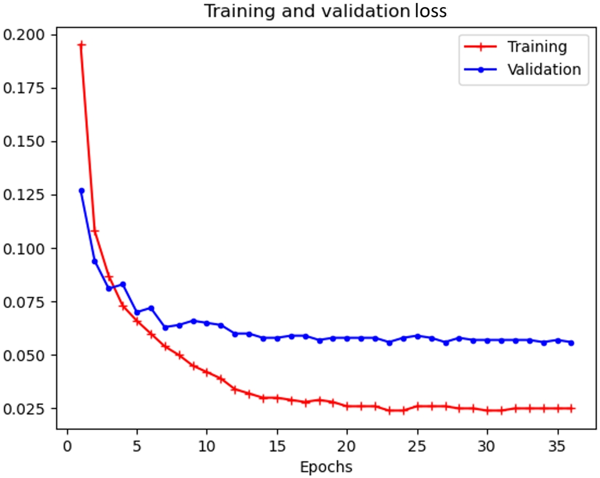

UIHash
====================================================

Detecting similar user interfaces (UIs) in Android apps by a grid-based representation.

Cite
----
> Jiawei Li, Jian Mao, Jun Zeng, Qixiao Lin, Shaowen Feng, and Zhenkai Liang. UIHash: Detecting Similar Android UIs through Grid-Based Visual Appearance Representation. In USENIX Security Symposium, 2024.

New: Alternative Version
-------------------
We also propose [UIHash-Serve](https://github.com/DaweiX/UIHash-Serve), another UIHash version that works better on headless servers.
It uses QEMU for dynamic app testing and [Faiss](https://github.com/facebookresearch/faiss) for similarity searching. Feel free to try it!

Requirements
------------

We develop UIHash on Python3.7 and test it on Python3.7.4 and Python3.7.9.

The important required packages for our implementation are:

* numpy~=1.19.3
* matplotlib~=3.5.1
* pandas~=1.3.5
* torch>=1.2.0
* bokeh~=2.3.3
* umap~=0.1.1
* opencv-python~=4.5.5.64
* torchvision~=0.4.0
* progressbar~=2.5
* Pillow~=7.1.2
* seaborn~=0.11.2
* scipy~=1.7.3
* sklearn~=0.0
* scikit-learn~=1.0.2

We recommend installing PyTorch (torch) with GPU support when CUDA is available. It works for CPUs as well. In the case of Intel CPU, the detection framework will work much faster if MKL (Math Kernel Library) works with PyTorch.

The following packages are used to collect UIs and other app features:

* androguard~=3.4.0a1
* airtest~=1.2.4

We use ADB (1.0.41, Version 31.0.3-7562133) to communicate with Android devices.

Datasets
--------

We list the public datasets used in the paper as follows:

- RePack dataset: RePack (https://github.com/serval-snt-uni-lu/RePack) is an Android repackaged app dataset collected from AndroZoo (https://androzoo.uni.lu/). Its ground truth listed over 15,000 app pairs. We use the dataset to evaluate the effectiveness of UIHash.

- Malware dataset: RmvDroid (https://ieeexplore.ieee.org/document/8816783) is an Android malware dataset, containing 9,133 samples that belong to 56 malware families with high confidence. The apps are collected by analyzing Google Play snapshots across different years. Since there is no UI ground truth for this dataset, we take the dataset to evaluate UIHash's capacity of discovering similar UI clusters.  

- Rico dataset: Rico (http://interactionmining.org/rico) is an Android UI dataset with over 72K unique UIs. We use the dataset in our implementation to improve the effectiveness of the CNN model for view image reidentification.

Project Structure
--------------------
```
[uihash]
│    README.md                     This file
│
├----collect                       * Collect UI dynamically
│       device.py                       Android device object
|       manual_capture.py               A test script for UI capture
│       ui_crawler.py                   Traverse UIs
│
├----hasher                        * Generate UI#
│       extract_view_images.py          Extract view images from UIs
│       reclass.py                      Use a CNN model to reidentify views
│       xml2nodes.py                    Extract visible controls from hierarchy XML
│       nodes2hash.py                   Given visible controls, generate UI#
│       uihash.py                       Generate UI# for an app dataset
│
├----mlalgos                       * Learning-based similarity analysis
│       dataset.py                      Generate input dataset for machine learning
│       network.py                      Neural networks implementation
│       siamese.py                      Calculate similarity score via a Siamese network
│       hca.py                          Clustering analysis
│
├----platform                      *  Extract various app features
│       apkparser.py                    The main program
│       decompile.py                    Decompile an app for code-level inspection
│       extract_apk.py                  Analyse an app and extract its features
│
└----util                          * Helper functions
        util_draw.py                    Draw plots
        util_file.py                    Deal with files or folders
        util_log.py                     Logger
        util_math.py                    Multiple calculations
        util_platform.py                Helper functions used for the platform
        util_xml.py                     Read, parse and process XML documents
```

Usage
--------

To demonstrate the reproducibility of the best performance reported in our paper and facilitate researchers to track whether the model status is consistent with ours, we provide the best parameter settings in the codes and provide the log for our training at the bottom of this document. We provide detailed end-to-end (i.e., Android apk files to results) guidance as follows:

### (0) Collect UIs

Run the following command to collect UI from apk files dynamically:

``python ./collect/ui_crawler.py path/to/apks device_ip``

The detailed usage of the script is:

```text
    usage: ui_crawler.py [-h] [--start START] [--end END] [--resume] [--overwrite]
                        [--package_name] [--logging {debug,info,warn,error}]
                        apk_folder ip

    Launch dynamic testing and collect UIs

    positional arguments:
      apk_folder            the path where you put apks
      ip                    ip address of the android device

    optional arguments:
      -h, --help            show this help message and exit
      --start START, -s START
                            start index of apk testing
      --end END, -e END     last index of apk testing
      --resume, -r          if assigned, start from the recorded last position
                            instead of value start
      --overwrite, -o       if assigned, overwrite the existing output
      --package_name, -p    if assigned, the output folder for an app will be
                            named by the apk's package name instead of its file
                            name
      --logging {debug,info,warn,error}, -l {debug,info,warn,error}
                            logging level, default: info
```

### (1) Extract Views from UIs 

The first step to generating UI# is to extract view images from UI to re-identify them based on their appearances, instead of their declared names in the hierarchy or layout file. A command example to extract views is


```bash
    python ./hasher/extract_view_images.py path/to/ui/collecting/output
```

Show help by running ``python extract_view_images.py -h``:

```text

    usage: extract_view_images.py [-h] [--rico] [--naivexml] [--skip] input_path

    Extract view images from UIs, support UI hierarchy printed by naive adb,
    uiautomator2 and RICO

    positional arguments:
      input_path      the path where UI hierarchy exists

    optional arguments:
    -h, --help      show this help message and exit
    --rico, -r      extract view images from rico UIs
    --naivexml, -n  assign it when using naive adb, and ignore it when using
                    uiautomator2 xml
    --skip, -s      skip the existing items
```

### (2) Recognize Control Types 

Reclass the view images. The model will be saved or loaded in a folder named ``models``. If it does not exist or exists but is required to be updated, then the module will train a new one. An example command is

```bash
    python ./hasher/reclass.py path/to/view/image/dataset path/to/ui/collecting/output --notskip
```
Show help by running ``python reclass.py -h``:

```text
    usage: reclass.py [-h] [--lr LR] [--decay DECAY] [--batch_size BATCH_SIZE]
                      [--epoch EPOCH] [--threshold THRESHOLD] [--retrain]
                      [--notskip]
                      dataset_path input_path

    Reidentify UI controls based on their image features

    positional arguments:
      dataset_path          the path for view image dataset. I get the view type
                            names according to it
      input_path            input path

    optional arguments:
    -h, --help            show this help message and exit
    --lr LR, -l LR        training learning rate of the model
    --decay DECAY, -d DECAY
                          training learning rate decay of the model, format:
                          decay_epoch,decay_rate
    --batch_size BATCH_SIZE, -b BATCH_SIZE
                          training batch size of the model
    --epoch EPOCH, -e EPOCH
                          training epoch of the model
    --threshold THRESHOLD, -t THRESHOLD
                          prediction confidence of the model
    --retrain, -r         retrain and overwrite the existing model
    --notskip, -s         do not skip the reidentified items
```

The default values for the input arguments are:

**name**    | **value** | **name** | **value**
------------| -----------| ---------| -----------
lr          | 0.003      | decay    |  4,0.1
batch_size  | 128        | epoch    |  12
threshold   | 0.95       | retrain  |  False
------------ ------------ ---------- -----------

### (3) Generate UI#

Given UI hierarchy and re-identified view type, run commands like

```bash
    # for original apps
    python ./hasher/uihash.py path/to/opt_original_apk/ path/to/view/image/dataset -d ori
    # for repackaged apps
    python ./hasher/uihash.py path/to/opt_repackage_apk/ path/to/view/image/dataset -d re
    # for unlabeled apps
    python ./hasher/uihash.py path/to/opt_xxx_apk/
```

to generate UI# for labeled or unlabeled app dataset. After the process exit, we have ``name_[dataset]_5x5x10.npy`` and ``hash_[dataset]_5x5x10.npy`` under the folder ``output/hash``. The field [dataset] might be one of "ori" (for original apps in a labeled dataset), "re" (for repackaged apps in a labeled dataset), or the name of an unlabeled dataset. The former file records the metadata like app names and activity names. The latter file holds the UI# matrices.

Show help by running ``python uihash.py -h``:

```text
    usage: uihash.py [-h] [--output_path OUTPUT_PATH] [--naivexml]
                     [--dataset_name DATASET_NAME] [--grid_size GRID_SIZE]
                     [--filter FILTER]
                     input_path [input_path ...] view_image_path

    Turns UI into UI#

    positional arguments:
      input_path            input paths
      view_image_path       path for the view image dataset

    optional arguments:
      -h, --help            show this help message and exit
      --output_path OUTPUT_PATH, -o OUTPUT_PATH
                            output path
      --naivexml, -n        assign it when using naive adb, and ignore it
                            when use uiautomator2 xml
      --dataset_name DATASET_NAME, -d DATASET_NAME
                            make it 'ori' when the only ipt_path is the original
                            apps in a labeled dataset like RePack, and 're' for
                            the repackaged apps. Just keep it unset when working
                            on an unlabeled dataset
      --grid_size GRID_SIZE, -g GRID_SIZE
                            expected grid size for UI#. format:
                            tick_horizontal,tick_vertical
      --filter FILTER, -f FILTER
                            0 to remove the filter, otherwise the threshold of the
                            minimal accepted visible nodes in a UI
```

The default value for ``grid_size`` is ``5,5``, and the default value for ``filter`` is 5. If not assign an ``output_path``, it will be ``<uihash_homepath>/output/hash``.

### (4) Generate Dataset

Run ``python ./mlalgos/dataset.py -h`` to show help as below:

```text
    usage: dataset.py [-h] [--hash_size HASH_SIZE]
                      input_path [input_path ...] app_pair_list

    Generate dataset for training and detection

    positional arguments:
      input_path            input paths of repack app
      app_pair_list         a txt file indicating app pairs in a similar app
                            dataset

    optional arguments:
      -h, --help            show this help message and exit
      --hash_size HASH_SIZE, -hs HASH_SIZE
                            shape of the input UI#
```

The module outputs ``Re_5x5x10.npz``, ``ReDP_5x5x10.npy and`` ``ReSP_5x5x10.npy`` in ``output/dataset``, where ``SP`` represents for similar pairs, and ``DP`` indicates that UI# pairs in it are dissimilar. 

For unlabeled dataset generation, please use the class `WildDataSet` instead.

### (5) Get Results

Run detection based on a siamese network. Similar to the model for reidentify views, the siamese model will also be saved or loaded in a folder named ``models``. If it does not exist or exists but is required to be updated, then ``siamese.py`` will train a new one.

```bash
    python ./mlalgos/siamese.py -R -f
```

```text
    usage: siamese.py [-h] [--Repack] [--dataset_name DATASET_NAME] [--lr LR]
                      [--decay DECAY] [--batch_size BATCH_SIZE] [--epoch EPOCH]
                      [--threshold THRESHOLD] [--retrain] [--notskip] [--figure]
                      [--hash_size HASH_SIZE]

    Run the siamese network on a dataset

    optional arguments:
    -h, --help              show this help message and exit
    --Repack, -R            use repack dataset
    --dataset_name DATASET_NAME, -dn DATASET_NAME
                            if not use repack dataset, then assign another dataset
                            name. make sure the hash files exist in output/hash
    --lr LR, -l LR          training learning rate of the model
    --decay DECAY, -d DECAY
                            training learning rate decay of the model, format:
                            decay_epoch,decay_rate
    --batch_size BATCH_SIZE, -b BATCH_SIZE
                            batch size for the model
    --epoch EPOCH, -e EPOCH
                            training epoch of the model
    --threshold THRESHOLD, -t THRESHOLD
                            the threshold to determine whether a pair is similar.
                            note that if apply detection on a wild dataset, then the
                            threshold also serves for filtering similar UIs in
                            each app
    --retrain, -r           retrain and overwrite the existing model
    --notskip, -s           do not skip the reidentified items
    --figure, -f            draw and show roc figure
    --hash_size HASH_SIZE, -hs HASH_SIZE
                            shape of UI#. format:
                            channel,tick_horizontal,tick_vertical
```

The default values for the input arguments are:

**name**    | **value** | **name** | **value**
------------| -----------| ---------| -----------
lr          | 0.001      | decay    | 10,0.1
batch_size  | 32         | epoch    | 36
threshold   | 0.6        | retrain  | False
hash_size   | 10,5,5     | figure   | False

The final output is the precision, recall, and F1 score on the test dataset. Use ``--figure`` to inspect the ROC curve.

When implementing a brute large-scale pair-wise detecting, we select 20,000 as the batch size for a GPU with 2GB graphic memory. The value can be increased to a higher value, depending on your hardware.

Outputs for a single run:
```python
DEVICE: cpu
Training (1/36) 100% |========================================================|
Validating (1/36) 100% |======================================================|
Train Loss 0.195 Valid Loss 0.127 lr 0.001
Training (2/36) 100% |========================================================|
Validating (2/36) 100% |======================================================|
Train Loss 0.108 Valid Loss 0.094 lr 0.001
Training (3/36) 100% |========================================================|
Validating (3/36) 100% |======================================================|
Train Loss 0.087 Valid Loss 0.081 lr 0.001
Training (4/36) 100% |========================================================|
Validating (4/36) 100% |======================================================|
Train Loss 0.073 Valid Loss 0.083 lr 0.001
Training (5/36) 100% |========================================================|
Validating (5/36) 100% |======================================================|
Train Loss 0.066 Valid Loss 0.07 lr 0.001
Training (6/36) 100% |========================================================|
Validating (6/36) 100% |======================================================|
Train Loss 0.06 Valid Loss 0.072 lr 0.001
Training (7/36) 100% |========================================================|
Validating (7/36) 100% |======================================================|
Train Loss 0.054 Valid Loss 0.063 lr 0.001
Training (8/36) 100% |========================================================|
Validating (8/36) 100% |======================================================|
Train Loss 0.05 Valid Loss 0.064 lr 0.001
Training (9/36) 100% |========================================================|
Validating (9/36) 100% |======================================================|
Train Loss 0.045 Valid Loss 0.066 lr 0.001
Training (10/36) 100% |=======================================================|
Validating (10/36) 100% |=====================================================|
Train Loss 0.042 Valid Loss 0.065 lr 0.001
Training (11/36) 100% |=======================================================|
Validating (11/36) 100% |=====================================================|
Train Loss 0.039 Valid Loss 0.064 lr 0.0001
Training (12/36) 100% |=======================================================|
Validating (12/36) 100% |=====================================================|
Train Loss 0.034 Valid Loss 0.06 lr 0.0001
Training (13/36) 100% |=======================================================|
Validating (13/36) 100% |=====================================================|
Train Loss 0.032 Valid Loss 0.06 lr 0.0001
Training (14/36) 100% |=======================================================|
Validating (14/36) 100% |=====================================================|
Train Loss 0.03 Valid Loss 0.058 lr 0.0001
Training (15/36) 100% |=======================================================|
Validating (15/36) 100% |=====================================================|
Train Loss 0.03 Valid Loss 0.058 lr 0.0001
Training (16/36) 100% |=======================================================|
Validating (16/36) 100% |=====================================================|
Train Loss 0.029 Valid Loss 0.059 lr 0.0001
Training (17/36) 100% |=======================================================|
Validating (17/36) 100% |=====================================================|
Train Loss 0.028 Valid Loss 0.059 lr 0.0001
Training (18/36) 100% |=======================================================|
Validating (18/36) 100% |=====================================================|
Train Loss 0.029 Valid Loss 0.057 lr 0.0001
Training (19/36) 100% |=======================================================|
Validating (19/36) 100% |=====================================================|
Train Loss 0.028 Valid Loss 0.058 lr 0.0001
Training (20/36) 100% |=======================================================|
Validating (20/36) 100% |=====================================================|
Train Loss 0.026 Valid Loss 0.058 lr 0.0001
Training (21/36) 100% |=======================================================|
Validating (21/36) 100% |=====================================================|
Train Loss 0.026 Valid Loss 0.058 lr 1.0000000000000003e-05
Training (22/36) 100% |=======================================================|
Validating (22/36) 100% |=====================================================|
Train Loss 0.026 Valid Loss 0.058 lr 1.0000000000000003e-05
Training (23/36) 100% |=======================================================|
Validating (23/36) 100% |=====================================================|
Train Loss 0.024 Valid Loss 0.056 lr 1.0000000000000003e-05
Training (24/36) 100% |=======================================================|
Validating (24/36) 100% |=====================================================|
Train Loss 0.024 Valid Loss 0.058 lr 1.0000000000000003e-05
Training (25/36) 100% |=======================================================|
Validating (25/36) 100% |=====================================================|
Train Loss 0.026 Valid Loss 0.059 lr 1.0000000000000003e-05
Training (26/36) 100% |=======================================================|
Validating (26/36) 100% |=====================================================|
Train Loss 0.026 Valid Loss 0.058 lr 1.0000000000000003e-05
Training (27/36) 100% |=======================================================|
Validating (27/36) 100% |=====================================================|
Train Loss 0.026 Valid Loss 0.056 lr 1.0000000000000003e-05
Training (28/36) 100% |=======================================================|
Validating (28/36) 100% |=====================================================|
Train Loss 0.025 Valid Loss 0.058 lr 1.0000000000000003e-05
Training (29/36) 100% |=======================================================|
Validating (29/36) 100% |=====================================================|
Train Loss 0.025 Valid Loss 0.057 lr 1.0000000000000003e-05
Training (30/36) 100% |=======================================================|
Validating (30/36) 100% |=====================================================|
Train Loss 0.024 Valid Loss 0.057 lr 1.0000000000000003e-05
Training (31/36) 100% |=======================================================|
Validating (31/36) 100% |=====================================================|
Train Loss 0.024 Valid Loss 0.057 lr 1.0000000000000002e-06
Training (32/36) 100% |=======================================================|
Validating (32/36) 100% |=====================================================|
Train Loss 0.025 Valid Loss 0.057 lr 1.0000000000000002e-06
Training (33/36) 100% |=======================================================|
Validating (33/36) 100% |=====================================================|
Train Loss 0.025 Valid Loss 0.057 lr 1.0000000000000002e-06
Training (34/36) 100% |=======================================================|
Validating (34/36) 100% |=====================================================|
Train Loss 0.025 Valid Loss 0.056 lr 1.0000000000000002e-06
Training (35/36) 100% |=======================================================|
Validating (35/36) 100% |=====================================================|
Train Loss 0.025 Valid Loss 0.057 lr 1.0000000000000002e-06
Training (36/36) 100% |=======================================================|
Validating (36/36) 100% |=====================================================|
Train Loss 0.025 Valid Loss 0.056 lr 1.0000000000000002e-06
training time cost: 32.7671793
model saved
prediction time cost: 0.025467499999999976
p: 0.9786324786324786
r: 0.9870689655172413
f1: 0.9828326180257511
auc: 0.9966211279953244
```

Train and validation loss curve:


